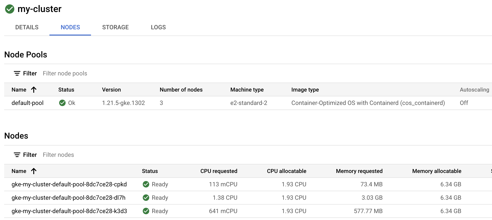
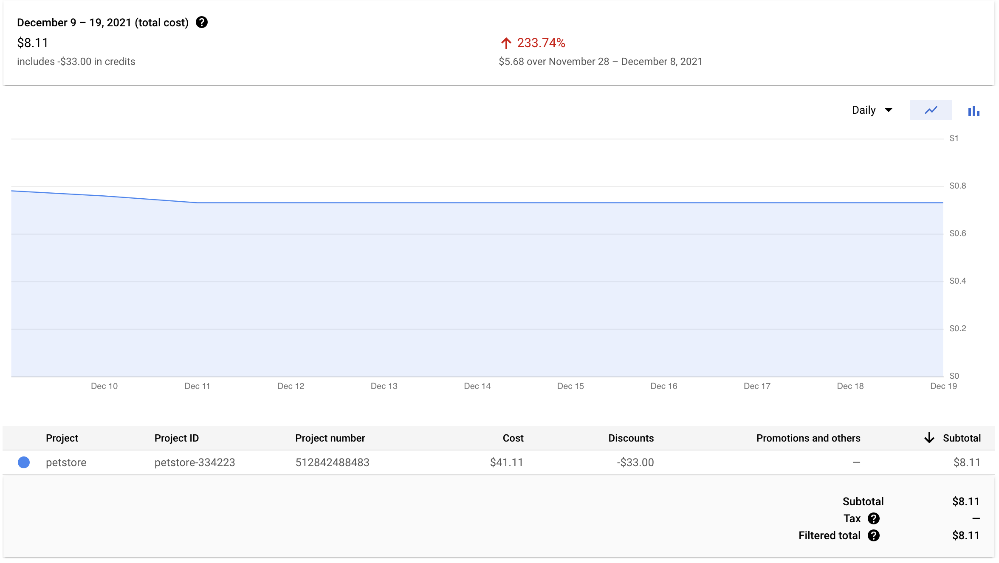
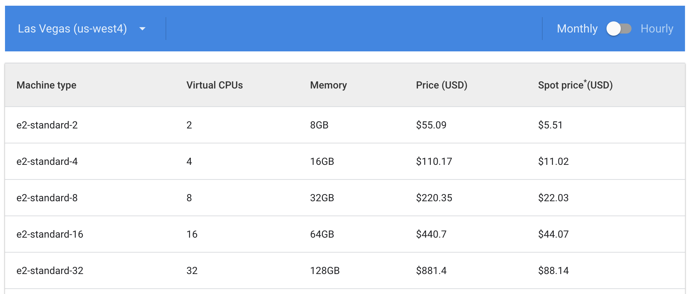
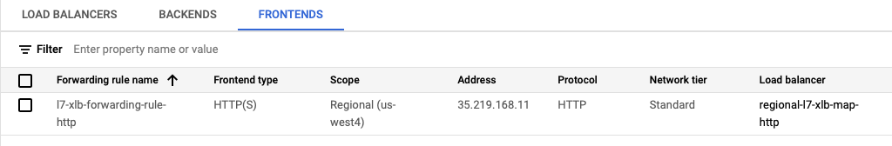

# How to Run a GKE Cluster on the Cheap (Under $25 Per Month)

It is possible to run a 3 node, 6 core, 24 GB RAM GKE cluster for under $25 per month! In this Git repository, you can use Terraform to deploy a GKE cluster with all of the cost savings maneuvers in place to get you up and running with GKE on the cheap!

**Warning: Google Cloud only gives you 1 free GKE control plane. If you run more than 1 GKE cluster, you will incur $74.40 per month for each control plane no matter what!**

### >>> [See article on **The New Stack** for an Overview of this Solution](https://thenewstack.io/run-a-google-kubernetes-engine-cluster-for-under-25-month/) <<<

The total (all inclusive for all GCP services) cost of running the 3 node, 6 core GKE cluster over a period of 30 days is $21.93, plus minimal charges for data ingress through a NAT gateway. This price includes the full 90% discount for Spot VMs in `us-west4` during this period of time along with other cost savings maneuvers to minimize the overall cost of the GKE cluster.


*Image 1: 3 node GKE Cluster, with a total of 24 GB of RAM, and 6 cores.*


*Image 2: Total (all inclusive) cost of running the GKE cluster over 10 days.*


*Image 3: Spot VM pricing in us-west4.*

### Who is this for?

This solution is primarily for people learning Kubernetes and GKE, or just people tinkering with GKE that don't want to pay full price. GKE is expensive to the individual and this solution makes it even cheaper than low-cost Kubernetes services like Civo (provided that you only run 1 cluster).

The solution, and its cost savings, is scalable to a larger cluster. It is conceivable that cost-conscious organizations may be interested in the techniques used in this solution as well. Just be aware of the drawbacks! See the blog post for more information.

## Prepare to Deploy the GKE Cluster

It is assumed that you already have `gcloud` installed and initialized for use with your project. If not, follow the instructions on this [page](https://cloud.google.com/sdk/docs/install).

### Install Terraform and Helm

Terraform and Helm are required to run the deployment on your local machine. On a Mac you can use Homebrew by running these commands:

```bash
brew tap hashicorp/tap
brew install hashicorp/tap/terraform

brew install helm
```

### Configure Terraform

Change `terraform.tfvars` to use your Google Cloud `PROJECT_ID`. You can find your `PROJECT_ID` by running this command:

```bash
gcloud projects list
```

You should also update your current project for `gcloud` if it's not set to the one that you intend to deploy the cluster to:

```bash
gcloud config set project REPLACE_WITH_YOUR_PROJECT_ID
```
You may also change the region you choose to deploy. Each GCP region has different pricing for VM Spot instances. See this [page](https://cloud.google.com/compute/vm-instance-pricing) for pricing details.

### Optional: Enable HTTPS

If you choose to enable HTTPS (with HTTP redirect) at the load balancer, you can enable this in the `terraform.tfvars` by setting `https` to `true`. With the default configuration, a self-signed certificate is used. You can also use your own certificate as well by adding your own `.crt` and `.key` and configuring with the path to the files in `terraform.tfvars`.

**Note:** To continue the cheap theme, you can purchase a domain name and a 1-year SSL certificate from [NameCheap](http://namecheap.com) for only $11 in total.

## Enable the GKE API

If you have never used GKE previously on your account, the GKE API needs to be enabled first. This can be done using the following command:

```
gcloud services enable container.googleapis.com
```

## Deploy the GKE Cluster

Now you can run Terraform to deploy GKE and all of the supporting components needed for this solution to work.

```bash
cd terraform
terraform init
terraform apply --auto-approve
```

Terraform will take several minutes to run. Please be patient! A lot of things are being provisioned and installed beyond just GKE.

Next, you must deploy the Petstore sample application and a `VirtualService` to route traffic to that application:

```bash
kubectl apply -f ../petstore.yaml
kubectl apply -f ../virtualservice.yaml
```

Next, get the IP Address of the load balancer for running the `curl` command to verify deployment. Change the `my-static-ip` if it was changed in the `terraform.tfvars`
```bash
ipaddress=$(gcloud compute addresses describe my-static-ip --format="value(address)")
```

**IMPORTANT: WAIT UP TO 2 MINUTES FOR THE `ingressgateway` NEG TO BE CREATED AND THE LOAD BALANCER TO BECOME HEALTHY**

Run the curl command. You should see JSON data from the Petstore application.

If you see a HTTP response of `no healthy upstream`, either you need to wait a bit longer (up to 2 minutes), or there is something else wrong. Please make sure all of the pods are running in the `default` namespace and the `gloo-system` namespace as a first step to diagnose.

```bash
curl -i -L -k  http://$ipaddress

HTTP/1.1 200 OK
content-type: application/xml
date: Sun, 23 Jan 2022 21:41:52 GMT
content-length: 86
x-envoy-upstream-service-time: 0
server: envoy
via: 1.1 google

[{"id":1,"name":"Dog","status":"available"},{"id":2,"name":"Cat","status":"pending"}]
```

For `curl`, `-L` will follow HTTP redirects, and `-k` allows self-signed certificates, if you have https enabled for your installation in `terraform.tfvars` and are using the `self-signed` certificate in `/certs`.

## Tear Down the GKE Cluster

When you are done, you can remove everything from Google Cloud with these commands:

```
terraform destroy
```

Because the `ingressgateway` NEG is not part of the Terraform inventory, it needs to be deleted manually. Ignore the first error from `terraform destroy`. All 3 commands will likely need to be run.

## How Does It Work?

The overall solution is a bit complex and does use some Beta features of Google Cloud. However, the solution has been implemented in Terraform so it's easy to deploy, even with the many components and configurations required.

These are the main parts of the solution to achieve a high level of cost savings:

1. Use a private, [VPC-native](https://cloud.google.com/kubernetes-engine/docs/how-to/standalone-neg#create_a-native_cluster), [GKE cluster using only Spot VM instances](https://cloud.google.com/kubernetes-engine/docs/concepts/spot-vms) as the cluster nodes. This will save you up to 90% on the cost of VMs, depending on the GCP region. This could save you up to $150 per month for GKE node VMs for a 3 node, 6 core cluster.

1. Use a [Regional (rather than Global) HTTP Load Balancer](https://cloud.google.com/load-balancing/docs/https) which is currently free as a Beta preview. Additional costs may be incurred in the future. This currently saves you $18.26 per month.

    a. Attach the [Regional HTTP Load Balancer to a standalone NEG](https://cloud.google.com/kubernetes-engine/docs/how-to/standalone-neg#how_to) to route traffic directly from the Load Balancer to the GKE ingress gateway pods to achieve container-native load balancing.

1. Use [Gloo Edge](https://github.com/solo-io/gloo) for an Envoy-based GKE ingress gateway that provides advanced routing capabilities to services running in the cluster. Gloo Edge also provides reliable traffic routing to mitigate potential errors resulting from Spot VM node shutdowns. Gloo Edge is open source and free to use.

1. The [first GKE control plane is free](https://cloud.google.com/kubernetes-engine/pricing#cluster_management_fee_and_free_tier). This currently saves $74.40 per month.

1. Deploy a [Cloud NAT](https://cloud.google.com/nat/docs/overview) gateway to enable  egress from the private GKE cluster. Additional cost is about [$1 per VM per month](https://cloud.google.com/nat/pricing) plus $0.045 per GB for data processing on egress traffic (which is primarily for pulling external Docker images). If you pull a lot of your own images, using [Artifact Registry](https://cloud.google.com/artifact-registry) would be advisable.

1. Disable [Cloud Logging](https://cloud.google.com/logging) for the GKE cluster. With the default settings, the Free Tier logging limits will be overcome within several days therefore adding significant additional expense. 

Terraform configs (`.tf`) are commented with specific details and references to explain how the deployment works and why. Also see the blog post for specifics.

## Next Steps For Using Your Cheap GKE Cluster

### Understanding Gloo Edge

[Gloo Edge](https://docs.solo.io/gloo-edge/master/) provides powerful traffic routing capabilities that go far beyond the standard [Kubernetes Ingress](https://kubernetes.io/docs/concepts/services-networking/ingress/). As Gloo Edge uses Envoy, capabilities such as retries help improve the resiliency of routing to applications in your cluster that is using Spot VM node instances.

It's beneficial, but not required, to [install `glooctl`](https://docs.solo.io/gloo-edge/master/installation/glooctl_setup/) to work with Gloo Edge. Here is how you install it on a Mac with Homebrew.

```
brew install glooctl
```

### Update Config and Deploy Another Application

Next you should proceed with:

1. Examining `virtualservice.yaml` and [understand how it works](https://docs.solo.io/gloo-edge/master/introduction/traffic_management/).
1. Deploying your own application onto your new Kubernetes cluster.
1. Modifying `virtualservice.yaml` to use your application's upstream. You can view upstreams with `glooctl get upstream`. Make sure the application is available at `/` or the Load Balancer health checks will fail. You may choose to rewrite the path as is done in `virtualservice.yaml` or change the `regional-l7-xlb-map-http` and `l7-xlb-basic-check-http` in `load-balancer.tf` to use a path other than `"/"`.

### Use Anti-Affinity Rules for Application Resilency

Spot VM nodes can be shut down at any time. You should strive to run 2 replicas of your pods with `podAntiAffinity` set. See `petstore.yaml` for an example of this.

### Use Retries for Application Resilency

When a Spot VM node goes down, there may be traffic in route to the pods on that node. This may result in HTTP errors. As such, it's best to implement a retry mechanism that  allows HTTP requests to be resent to the 2nd instance of your application. See `virtualservice.yaml` for an example of implementing retries with Gloo Edge.

If you have a microservice architecture with microservices deployed across nodes, Istio service mesh (not provided in this solution) would allow you to implement retries between services. This topic might be covered in a future blog post in the context of this solution.

### Use Artifact Registry for Deploying Private Images

First, make sure the Artifact Registry API is enabled for your project:

```
gcloud services enable artifactregistry.googleapis.com
```

You may use the Google Cloud console, or use the `gcloud` command line to create a repository. Replace `my-repo` with your desired repository name. You may also consider having a global repo, see the Artifact Repository docs for more info.

```
gcloud artifacts repositories create REPLACE_WITH_YOUR_REPO --repository-format=docker --location=REPLACE_WITH_YOUR_REGION --description="My Docker repository"
```

Next, get your Artifact Registry Docker credentials:

```
gcloud auth configure-docker REPLACE_WITH_YOUR_REGION-docker.pkg.dev
```

Next, pull an image (if you don't already have one) that you want to push to the Artifact Respotory:

```
docker pull docker.io/soloio/petstore-example:latest
```

Tag the image for Artifact Repository.

```
docker tag soloio/petstore-example REPLACE_WITH_YOUR_REGION-docker.pkg.dev/REPLACE_WITH_YOUR_PROJECT_ID/REPLACE_WITH_YOUR_REPO/petstore-example
```

Push the image to Artifact Repository:

```
docker push REPLACE_WITH_YOUR_REGION-docker.pkg.dev/YOUR-PROJECT/REPLACE_WITH_YOUR_REPO/petstore-example
```

As an example for deploying from Artifact Repository, you can try to deploy the Petstore example. Modify `petstore-pkg-dev.yaml` to your needs and run:

```
kubectl apply petstore-pkg-dev.yaml
```

## Frequently Asked Questions

1. *Is this GKE cluster, given the drawbacks of Spot VM nodes, really all that useful?*

    Absolutely, it's useful. This is a real GKE cluster with 3 nodes, 6 cores, and 24 GB of RAM running at minimal cost. This is great for people learning Kubernetes that need to run non-trivial workloads to better understand how to use Kubernetes in a real cloud environment, without the high cost and surprise, hidden charges.

2. *How long do the Spot VM nodes run?*

    The longest period of time that I have seen is 23 days in `us-west4`. Most typically will run for several days.

3. *Will only one Spot VM node be replaced at a time?*

    There is no guarantee when nodes or how many of the nodes will be replaced. Here is an example where 2 of the 3 nodes were replaced at the same time, as they both have the same age. Unfortunately, if your application workload only resided on those 2 nodes, it would have been temporarily offline until new pods spun up to replace them.

```
NAME                                        STATUS   ROLES    AGE     VERSION
gke-my-cluster-default-pool-8dc7ce28-dl7h   Ready    <none>   4h14m   v1.21.5-gke.1302
gke-my-cluster-default-pool-8dc7ce28-k3d3   Ready    <none>   4h14m   v1.21.5-gke.1302
gke-my-cluster-default-pool-8dc7ce28-cpkd   Ready    <none>   23d     v1.21.5-gke.1302
```

4. *How can I guarantee that my applications will stay online if multiple Spot VM nodes are replaced at the same time?*

    Having a 100% Spot VM node cluster is not recommended for critical production workloads. You might consider having 2 node pools and spread the workloads across both non-spot and spot nodes. You may consider using [Pod Topology Spread Constraints](https://kubernetes.io/docs/concepts/workloads/pods/pod-topology-spread-constraints/) where the `topologyKey` could be `cloud.google.com/gke-spot`. Of course, using non-spot nodes will result in additional cost, but having a portion of your cluster be spot nodes will save significant amounts of money compared to an entirely non-spot cluster.

    Generally speaking, the solution presented in this GitHub repo is for non-production purposes only.

5. *Why do I have `Terminated` pods and how can I get rid of them?*

    When a Spot VM node shuts down, pods residing on the node will move to a `Terminated` state. These `Terminated` pods do not consume resources and are simply replaced with new pods. Kubernetes [doesn't currently garbage collect](https://github.com/kubernetes/kubernetes/issues/99986) these `Terminated`/`Failed` pods until there are 12,500 of them! You may periodically delete these pods with the following command:

```
kubectl delete pods --field-selector status.phase=Failed --all-namespaces
```

6. *What GCP regions are compatible with this solution?*

    This solution has been tried successfully with `us-west4` and `asia-east2`, both of which have very low Spot VM instance prices. It was not compatible with `europe-central2` due to lack of the Standard networking tier. Otherwise, the best way to know is to give it a try and see if the deployment is successful.

7. *What about HTTPS/TLS termination for the Regional HTTP Load Balancer?*

    Implementing HTTPS (including a redirect) is possible, but not currently incorporated into this solution. There is a GitHub issue open [here](https://github.com/murphye/cheap-gke-cluster/issues/1) with details. 

8. *Can I do TCP passthrough rather than HTTP for the Regional Load Balancer?*

    This is not currently possible with Google's managed proxy service, but is possible with Envoy, should Google decide to support it in the future.

9. *Can I use an Ingress Controller implementation such as NGINX instead of Gloo Edge?*

    While not provided in this solution, yes you can use an alternative, but Gloo Edge/Envoy is ideally suited for this use case where a high level of resiliency is needed due to the use of Spot VM cluster nodes.

10. *In the Google Cloud console, why don't I don't see the deployed Load Balancer?*

    The Regional HTTP Load Balancer type is not supported in the Google Cloud console at this time. However, you will be able to see the Backend and the Forwarding Rules (Frontend), as shown:

    

11. *What if I have stateful workloads such as a PostgreSQL database?*

    Preferably, [create a regional persistent disk for PostgreSQL](https://cloud.google.com/architecture/deploying-highly-available-postgresql-with-gke) for deploying highly available PostgreSQL with GKE. This will not bound any of your data to the cluster nodes as the `PersistentVolumeClaim` will be external to the cluster.
    
      a. Any applications that you have connecting to the database must be able to automatically reconnect should the connection be lost temporarily during a node replacement. If this isn't possible, you should implement a `livenessProbe` for the application based on database connectivity so the application can be redeployed when the `livenessProbe` fails. 
   
      b. As an example, this [article](https://medium.com/@ievgen.degtiarenko/liveness-and-readiness-probes-for-spring-boot-apps-running-in-k8s-fd43a9a9dca8) explains how to do this with Spring Boot Actuator and PostgreSQL. You may also combine this with [HikariCP](https://github.com/brettwooldridge/HikariCP#essentials) for database connection pooling. Should HikariCP not be able to reconnect, eventually the `livenessProbe` will fail as well causing the Spring Boot application to be redeployed which may be desirable in an unrecoverable database connection scenario. As a best practice, a TCP socket timeout should be set to a minimum of 30 seconds. More information is available [here](https://github.com/brettwooldridge/HikariCP/issues/1056) and [here](https://www.theguardian.com/info/2019/dec/02/faster-postgresql-connection-recovery).

12. *Are there data transfer (ingress/egress) charges for Google Cloud that apply?*

     Please see the [blog post](https://thenewstack.io/run-a-google-kubernetes-engine-cluster-for-under-25-month/) for detailed information on pricing. For GCP, data ingress is free. For data egress, Standard Tier networking egress charges apply ($0.085 per GB). For someone learning Kubernetes and not serving live traffic from the cluster, data egress charges would be minimal (less than $0.01 per day on average).


13. *How do I use a domain name with my cluster?*

     If you have a domain name to use, you can add an A record with the load balancer IP address to point to your cluster. You can get this IP address by running the following (change `my-static-ip` to match what's in `terraform.tfvars`):

     ```
     ipaddress=$(gcloud compute addresses describe my-static-ip --format="value(address)")
     echo $ipaddress
     ```

14. *How do I update my SSL certificate without redeploying?*

     Unfortunately, there is not a way to update `gcloud compute ssl-certificates` in place. It is best to create a new ssl-certificate and update the 
     `target-https-proxies` for the certificate. Two swaps are necessary to prevent errors during `terraform destroy`.

     See `update-ssl-certificate.sh` which will automate the process. Update the values before running for your use.
