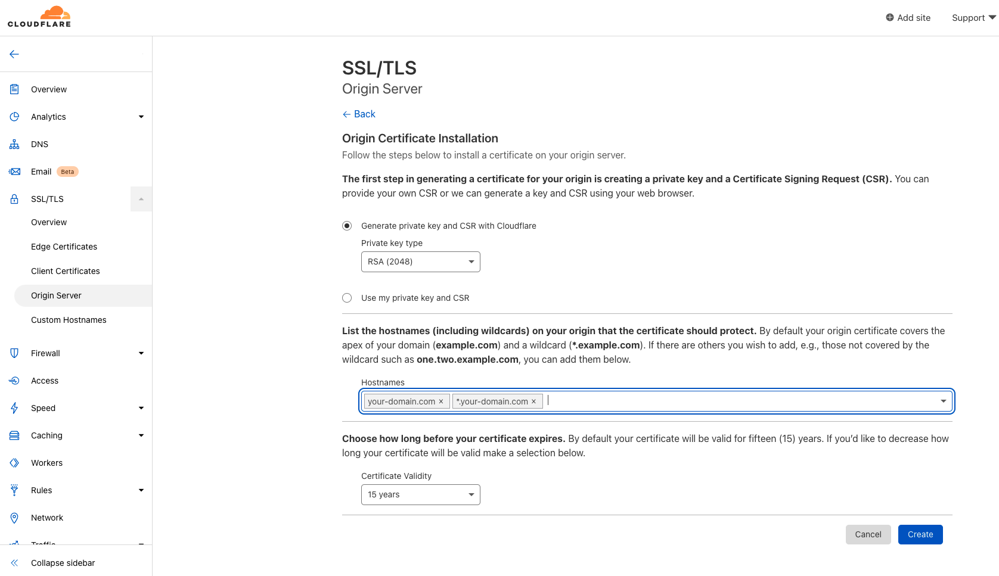
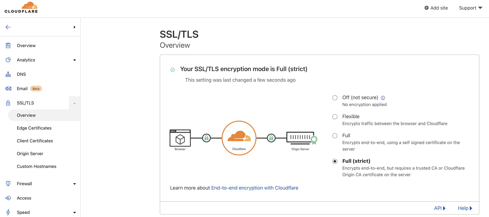
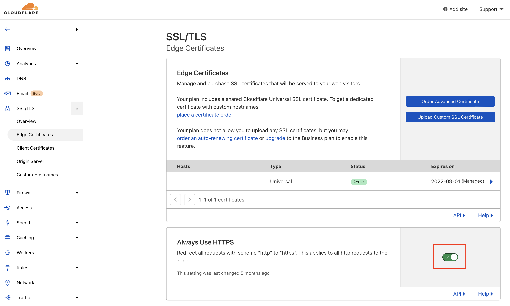

# Free https with cloudflare

CloudFlare can provide a forever free https certificate in front of your app.

The requirements are: 
- Create a free cloudflare account
- Buy a domain random dotcom is ~$8 (you can buy it directly from coudflare or you buy it externally and then configure dns with cloudflare)
- Create and Download a cloudflare generated and trusted certificate and key. If you have multiple domains all of them need to be managed in cloudflare and you need to list them all when creating the certificate.

- Use that certificate while setting up https with terraform
- Choose end-to end encryption in cloudflare

- Choose force everything to https

Enjoy free https 